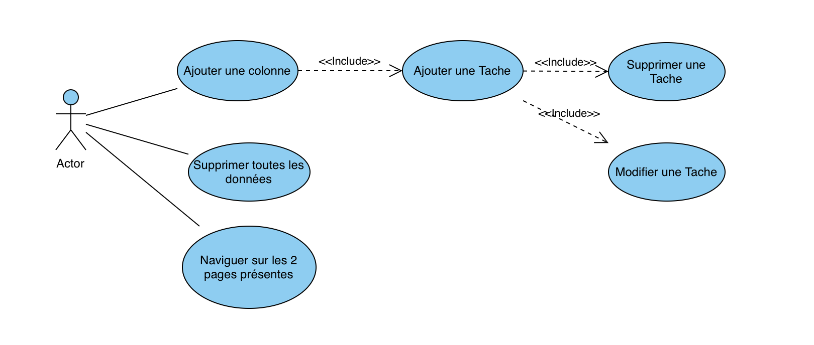

# UseCase Déprécated
## Document de Veille Front-end




# Lancement Rapide / QuickStart :

### Dépendances :
- Avoir pnpm (conséillé) ou npm / yarn
- Avoir L'environnement NodeJS
- Avoir git (recommandé++)
- Avoir angular-cli (obligé)


```
git clone https://github.com/intel1337/taiyang-baluc-veil-techno-frontend
cd taiyang-baluc-veil-techno-frontend 
pnpm i
ng serve
xdg-open http://localhost:4200 // Linux
open -a Firefox http://localhost:4200 // MacOS
start http://localhost:4200 // Windows
```

## Présentation des Technologies :

- Angular 20 (Utilisé par Notion)
- Router Angular
- Angular CLI
- Angular Router Outlet et Router Link
- FormsModule
- (Anciennement) NestJS
- angular.dev pour la documentation


## Pourquoi ?
- Angular car c'est un framework solide qui utilise la méthode SOLID,
verbeux, organisé, inversion de contrôle notable, besoin d'être rigoureux.

- Le router d'Angular pour définir mes routes car je souhaitais une landing page avant d'entrer sur le Kanban

- Angular CLI pour générer le projet (ng new), pour générer les composants (ng g c / s pour les services)
ou encore pour lancer le dev server (ng serve)

- Angular Router Outlet et Link pour pouvoir utiliser mes "components Angular" dans mes routes (exemple avec /kanban)
et pour revenir sur la Landing page (router link comme href ou passage de props)

- FormsModule pour utiliser les modèles

- NestJS car c'est un framework avec une alchimie parfaite avec Angular, services, controllers, models, injection de dépendance via constructor, fonctions ou décorateurs tout en TypeScript et très rigoureux. Sûrement pas utilisé lors du rendu de ce projet


## Les Inconvénients :
- Au niveau d'Angular et Nest, ce sont des frameworks souvent trop lourds et "time consuming" qui malheureusement ne sont souvent pas choisis lors de projets simplistes

- La verbosité et l'inversion de contrôle rigoureuse de ces 2 frameworks peuvent augmenter drastiquement la difficulté pour un développeur sans expérience notable en TypeScript / OOP / design patterns souvent retrouvés via Spring Boot, DRF (Django Rest Framework) ou Blazor / ASP.NET

- La version et le choix d'Angular 20 qui ne faisaient pas partie de mes connaissances ayant juste codé certains projets en Angular 17 et une montée de version de Angular 16 à 18


## Segmentation du développement
1. Méthodes à appliquer et BrainStorming
2. Définition du projet et du cahier des charges
3. Conception du front-end
4. Prototypage de la logique
5. Finalisation de la Logique
6. Finalisation du Front End
7. Refactor & documentation


# Arborescence 
```
. # Root Folder
├── angular.json 
├── package-lock.json # Dépendances et Scripts de production (pnpm ci )
├── package.json # Dépendances, Scripts (pnpm i)
├── public  # Images / données et fichiers publiques
│   └── favicon.ico
├── README.md # Documentation
├── src
│   ├── app
│   │   ├── (kanban) # Regroupement des éléments liés au kanban (syntaxe avec parenthèses venant de Next.JS)
│   │   │   ├── kanban  # Page Kanban
│   │   │   │   ├── kanban.css
│   │   │   │   ├── kanban.html
│   │   │   │   ├── kanban.spec.ts
│   │   │   │   └── kanban.ts
│   │   │   ├── model   # Interfaces / Types
│   │   │   │   └── kanban.ts
│   │   │   ├── row   # Rangée du Kanban
│   │   │   │   ├── row.css
│   │   │   │   ├── row.html
│   │   │   │   ├── row.spec.ts
│   │   │   │   └── row.ts
│   │   │   └── task  # Tache des rows du kanban
│   │   │       ├── task.css
│   │   │       ├── task.html
│   │   │       └── task.ts
│   │   ├── app.config.ts
│   │   ├── app.css
│   │   ├── app.html
│   │   ├── app.routes.ts
│   │   ├── app.spec.ts
│   │   ├── app.ts
│   │   ├── kanban.spec.ts # Unit Test d'un Service Déprécié
│   │   ├── kanban.ts # Service Déprécié
│   │   └── landing  # Landing Page / Root Page
│   │       ├── landing.css
│   │       ├── landing.html
│   │       ├── landing.spec.ts
│   │       └── landing.ts
│   ├── index.html
│   ├── main.ts
│   └── styles.css # Css globals contenant styling global, imports et css-resets 
├── tsconfig.app.json
├── tsconfig.json
└── tsconfig.spec.json

10 directories, 35 files
```


